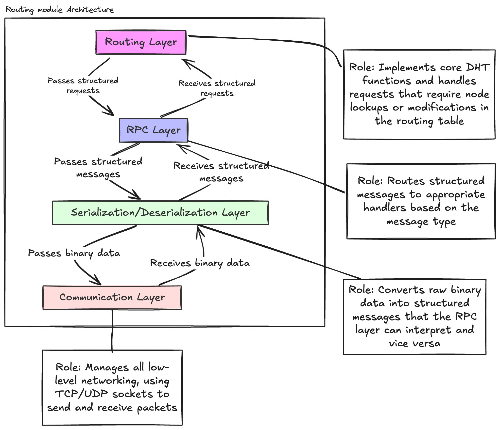

+++
date = '2024-12-03T13:40:17+03:00'
draft = false
title = '1 - Architecrue of Kdht: A Kademlia DHT in Rust'
tags = ["kdht", "rust", "distributed_systems", "dht"]
showTags=true
pinned = true
+++

## Architecture Overview

This post details the layered architecture of Kdht, breaking down the key components and their responsibilities.

{ width=250px height=250px }

### 1. Communication Layer

The communication layer handles all low-level networking operations using TCP/UDP sockets. Its core responsibilities include:

- Managing incoming message listeners
- Handling non-blocking I/O operations
- Implementing protocol-specific error handling
- Passing received binary data up to the serialization layer
- Sending binary data over the network
- Managing retries and error reporting for unreachable nodes

### 2. Serialization/Deserialization Layer 

This layer acts as a translator between raw binary data and structured messages. Key responsibilities:

- Decoding binary data into identified message types (PING, FIND_NODE, STORE, FIND_VALUE)
- Serializing structured responses back to binary format for transmission over the network
- Providing modular serialization/deserialization to support:
  - Multiple message formats (JSON for testing/debugging)
  - Integration with other DHT implementations
  - Future protocol extensions

### 3. RPC Layer

The RPC layer routes structured messages to appropriate handlers. Its responsibilities include:

- Routing messages to correct handlers based on type (PING, FIND_NODE, STORE, FIND_VALUE)
- Managing response flow back to the communication layer
- Implementing rate limiting and throttling for high traffic scenarios
- Protecting against load spikes and potential attacks

### 4. Routing Layer

This core layer implements the DHT functionality and routing table management:

- Maintains routing table and k-buckets using LRU (Least Recently Used) strategy for node lookups
- Implements caching for frequent lookups to improve performance and reduce network traffic
- Handles PING requests and routing table updates to maintain node liveness
- Processes FIND_NODE requests by locating closest nodes in the routing table
- Interfaces with storage module for FIND_VALUE and STORE operations

## Conclusion
The layers work together in a hierarchical fashion:

1. Communication Layer receives raw network data
2. Serialization Layer converts binary data to structured messages
3. RPC Layer routes messages to appropriate handlers
4. Routing Layer executes DHT operations and manages state

This layered architecture provides clear separation of concerns, making the system more maintainable and extensible. Each layer can be modified or replaced independently, simplifying testing and future enhancements. also it makes the code more readable and understandable. also I write the code in a way that each layer can be tested independently.

Stay tuned for upcoming posts where I'll share my learning journey and dive into specific implementation details. You can find the source code on [GitHub](https://github.com/aabolfazl/kdht).

Feel free to reach out if you have any questions or want to discuss DHT implementations!

Thank you for reading!